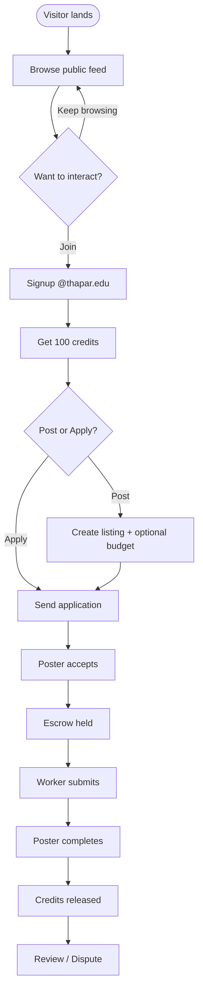
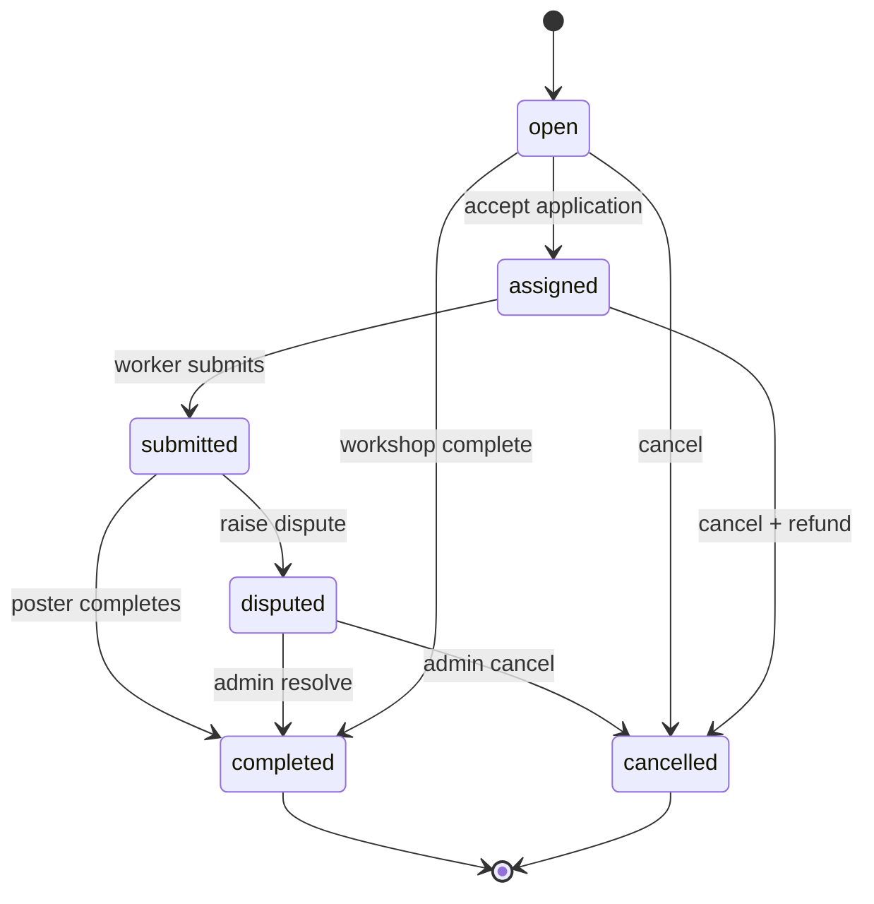
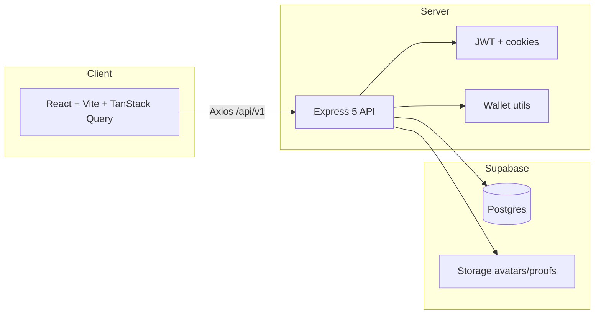
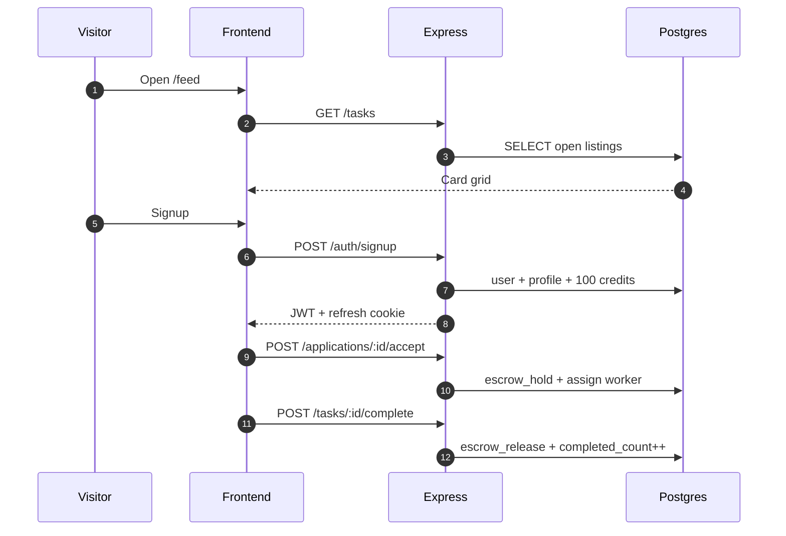

<div align="center">

# CampusGigs


**Public-first campus marketplace** — post work, host workshops, earn soft credits, build reputation.

<br/>

[](https://nodejs.org/)
[](https://react.dev/)
[](https://expressjs.com/)
[](https://www.typescriptlang.org/)
[](https://supabase.com/)
[](https://tailwindcss.com/)

[](#-live-feature-board)
[](#-how-it-works)
[](#-credits--escrow)
[](#-quality-gates)

| Local | URL |
|:------|:----|
| Web app | `http://localhost:5173` |
| Browse | `http://localhost:5173/feed` |
| API | `http://localhost:5000/api/v1` |
| Health | `http://localhost:5000/health` |

</div>

---

## Jump to

<details open>
<summary><b>Interactive table of contents</b> (click a section)</summary>

<br/>

| Want… | Go here |
|:------|:--------|
| See what ships today | [Live feature board](#-live-feature-board) |
| Understand the product in 20s | [How it works](#-how-it-works) |
| Credits / escrow | [Credits & escrow](#-credits--escrow) |
| Architecture diagrams | [Architecture](#-architecture) |
| Run locally in 3 mins | [Quick start](#-quick-start) |
| Copy-paste API map | [API explorer](#-api-explorer) |
| Role rules | [Campus roles](#-campus-roles) |
| Security model | [Security](#-security) |
| Contribute | [Contributing](#-contributing) |
| FAQ | [FAQ](#-faq) |

</details>

---

## Live feature board

<details open>
<summary><b>Click to expand / collapse</b> — Done vs Next</summary>

<br/>

| Area | Capability | Status |
|:-----|:-----------|:------:|
| Discovery | Public landing + live listing cards | Done |
| Discovery | Browse chips, filters, sort (newest / deadline / budget / rating) | Done |
| Auth | `@thapar.edu` signup · JWT + httpOnly refresh | Done |
| Roles | UG / M.Tech / PhD / Faculty (year limits) | Done |
| Listings | Gig · Workshop · Project · Mentorship | Done |
| Lifecycle | Apply → accept → submit → complete / cancel | Done |
| Money | Soft wallet · escrow hold / release / refund · 100 credit bonus | Done |
| Trust | Rating · completed count · verified badge on cards | Done |
| Collab | Messages inbox (3s poll) · notifications · reviews · disputes | Done |
| Smart | Category-history recommendations | Done |
| UX | Poster / worker dashboard · onboarding progress | Done |
| Admin | Stats · dispute queue · suspend user | Done |
| Quality | DB indexes · pino logs · Vitest · CI (FE + BE) | Done |
| Next | WebSockets realtime chat | Planned |
| Next | Playwright E2E | Planned |
| Next | Production deploy | Planned |

</details>

---

## How it works



<details>
<summary><b>60-second demo script</b> (follow along)</summary>

1. Open `/` — see hero + live listings (**no login**).
2. Open `/feed` — filter by Workshop / Frontend / CSED.
3. Sign up with `you@thapar.edu` — note **100 credits** in nav.
4. Post a gig with budget `20` credits.
5. Second account applies → first account **Accept** (escrow holds).
6. Worker **Submit** → poster **Complete** (credits release).
7. Optional: raise dispute → admin resolves.

</details>

<details>
<summary><b>Listing lifecycle state machine</b></summary>



</details>

---

## Credits & escrow

<div align="center">

| Event | What happens |
|:------|:-------------|
| Signup | +100 soft credits |
| Post with budget | Listing shows credit amount |
| Accept application | Credits **held** from poster |
| Complete task | Credits **released** to worker |
| Cancel (after hold) | Credits **refunded** to poster |

`GET /wallet/me` → balance + ledger

</div>

---

## Architecture



<details>
<summary><b>Why this architecture?</b></summary>

- Browser never talks to Postgres directly.
- Express owns auth (`app_users`) — not Supabase Auth.
- Supabase = **DB + Storage only**.
- Escrow is atomic inside DB transactions.

</details>

<details>
<summary><b>Request sequence</b> (browse → signup → escrow)</summary>



</details>

---

## Campus roles

<details open>
<summary><b>Signup rules</b></summary>

| Role | Year field | Extra fields |
|:-----|:-----------|:-------------|
| UG Student | 1–4 | Roll number |
| M.Tech | 1–2 | Roll number |
| PhD | 1–3 | Roll number |
| Faculty | none | Designation · can host workshops |

Program is inferred from **department** (no duplicate program field).

</details>

<details>
<summary><b>Categories</b> (17)</summary>

**Technical:** Frontend · Backend · GitHub & Open Source · Machine Learning · Data Science · DevOps & Cloud · Mobile Apps · Technical (Other)

**Non-technical:** Tutoring & Academics · Design & Creative · Content & Writing · Research Help · Lab & Project Support · Campus Errands · Mentorship & Career · Workshops & Events · Non-Technical (Other)

</details>

---

## Quick start

<details open>
<summary><b>Step 1 — Backend</b></summary>

```bash
cd backend
cp .env.example .env
npm install
npm run dev
```

Required env:

```env
DATABASE_URL=postgresql://postgres.<REF>:<PASS>@aws-0-<REGION>.pooler.supabase.com:5432/postgres
SUPABASE_URL=https://<REF>.supabase.co
SUPABASE_SERVICE_ROLE_KEY=...
JWT_ACCESS_SECRET=...
JWT_REFRESH_SECRET=...
CORS_ORIGINS=http://localhost:5173
ALLOWED_EMAIL_DOMAIN=thapar.edu
```

> Use **Session Pooler** (IPv4). Direct `db.*.supabase.co` often fails on campus Wi‑Fi.

</details>

<details>
<summary><b>Step 2 — Frontend</b></summary>

```bash
cd frontend
cp .env.example .env
npm install
npm run dev
```

```env
VITE_API_BASE_URL=http://localhost:5000
VITE_ALLOWED_EMAIL_DOMAIN=thapar.edu
```

Open **http://localhost:5173**

</details>

<details>
<summary><b>Step 3 — Admin promote</b></summary>

```sql
UPDATE public.profiles
SET is_admin = true
WHERE college_email = 'you@thapar.edu';
```

Then visit `/admin`.

</details>

---

## Quality gates

```bash
cd backend && npm run typecheck && npm test
cd frontend && npm run build
```

CI runs on every push/PR: frontend build + backend typecheck + Vitest unit tests  
→ [`.github/workflows/ci.yml`](.github/workflows/ci.yml)

---

## API explorer

<details>
<summary><b>Auth</b></summary>

| Method | Path | Notes |
|:-------|:-----|:------|
| POST | `/auth/signup` | Sets refresh cookie · +100 credits |
| POST | `/auth/login` | Access token + cookie |
| POST | `/auth/refresh` | Cookie required |
| POST | `/auth/logout` | JWT |
| GET | `/auth/me` | Current profile |

</details>

<details>
<summary><b>Catalog & tasks</b></summary>

| Method | Path | Notes |
|:-------|:-----|:------|
| GET | `/catalog/departments` | Public |
| GET | `/catalog/categories` | Technical / non-technical |
| GET | `/tasks` | `q` `listing_type` `category_id` `difficulty` `department_id` `sort` |
| GET | `/tasks/:id` | Public detail |
| GET | `/tasks/mine` | Poster / worker |
| POST | `/tasks` | Create (+ optional `budget`) |
| POST | `/tasks/:id/submit` | Worker |
| POST | `/tasks/:id/complete` | Poster · releases escrow |
| POST | `/tasks/:id/cancel` | Refund if held |
| POST | `/tasks/:id/complete-workshop` | Host only |

</details>

<details>
<summary><b>Applications · Wallet · Collab · Admin</b></summary>

| Method | Path | Notes |
|:-------|:-----|:------|
| POST | `/applications` | Apply |
| POST | `/applications/:id/accept` | Holds escrow |
| POST | `/applications/:id/reject` | Poster |
| GET | `/wallet/me` | Balance + ledger |
| * | `/messages/*` | Task threads + inbox |
| * | `/notifications/*` | Unread + mark read |
| * | `/reviews/*` | After complete |
| * | `/disputes/*` | Raise / resolve |
| GET | `/recommendations` | Personalized |
| GET | `/admin/users` `/stats` `/disputes` | Admin |
| POST | `/admin/users/:id/suspend` | Admin |

</details>

---

## Security

<details>
<summary><b>Hardening checklist</b></summary>

- JWT access + httpOnly refresh cookie
- `@thapar.edu` enforced client + server
- Zod validation on mutating routes
- Helmet + CORS + auth rate limits
- PostgREST `anon` / `authenticated` table grants revoked
- Service role key stays server-side only
- Escrow only via Express transactions (never client writes)
- Prod errors hide stack traces · pino structured logs

Full notes → [`docs/SECURITY.md`](docs/SECURITY.md)

</details>

---

## Repo map

```
Freelancer/
├── frontend/          # React SPA (landing, feed, dashboards)
├── backend/           # Express API + Vitest
├── supabase/          # migrations + seed
├── docs/SECURITY.md
├── CONTRIBUTING.md
├── freelancer_prd.md
└── .github/workflows/ci.yml
```

---

## Contributing

See [`CONTRIBUTING.md`](CONTRIBUTING.md).

Rules of the road:

1. Express is the only write path to Postgres.
2. Validate with Zod on every mutation.
3. Never commit `.env`.
4. Wallet changes stay inside DB transactions.

---

## FAQ

<details>
<summary><b>Why is the Department dropdown empty?</b></summary>

Backend cannot reach Postgres. Use the **Session Pooler** `DATABASE_URL`, then restart `backend`.

</details>

<details>
<summary><b>Do I need real money / Stripe?</b></summary>

No. Soft campus credits only. Real payments are deferred.

</details>

<details>
<summary><b>Can guests see listings?</b></summary>

Yes. Landing + `/feed` are public. Signup required to apply / post / message.

</details>

<details>
<summary><b>Staff / Department roles in signup?</b></summary>

Removed from signup by product choice. Schema still supports them if re-enabled later.

</details>

<details>
<summary><b>Where is the full PRD?</b></summary>

[`freelancer_prd.md`](freelancer_prd.md)

</details>

---

<div align="center">

**CampusGigs** · Thapar Institute · `@thapar.edu` only

<br/>

[Jump to top](#campusgigs) · [Feature board](#-live-feature-board) · [Quick start](#-quick-start) · [API explorer](#-api-explorer)

</div>
